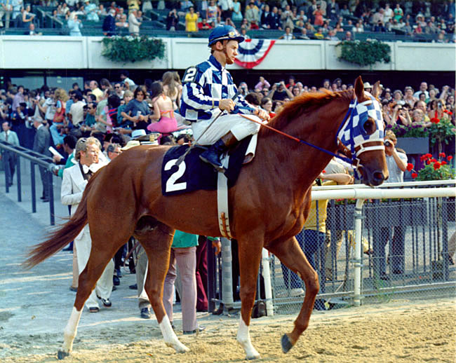

# Horsing Around: Horse Race Betting
  

    - Secretariat at the Belmount in 1974, the year he won the Triple Crown
  

## Can I make money using tipsers in horse race betting?

If you live near a race track, every year during racing season you might see more commotion, friends and family talking of going to see a race as a casual weekend past time. The conversation always eventually reaches betting. Someone might bring up: "Some people actually make a living driving from race to race, betting on the horses."
    
Some others, known as tipsters, make money providing tips on how to bet. In this project, I attempt to explore the question: If you were just a casual horse race bettor, would you win money following a tipster's advice?

## What is a tipster?

A tipster is someone known to be more knowledable about the subject and the outcome of sports events on internet sites or betting places. The information could be about any sport where people bet on the outcome, from football to *football*, horse or greyhound racing, tennis, etc.

### Tipster “Active” vs “Inactive” : 
Aggregation sites online rank tipsters by their profit performance value. At a certain point of negative profit, a tipster becomes “Inactive.” 
**For this data used in this discussion, the performance index used to determine Active/Inactive status is unknown.**

## Data

The data used in this analysis, provided by [@Data Society](https://data.world/data-society) on [Data World](https://data.world/data-society/horse-racing-tipster-bets), contains tips and odds from 

(TBR) Looking at horse race betting data and understanding betting odds with probabilities to win for a final presentation
