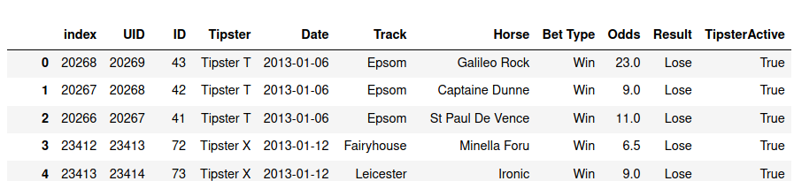
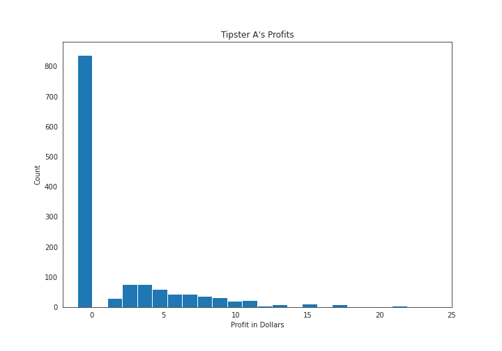
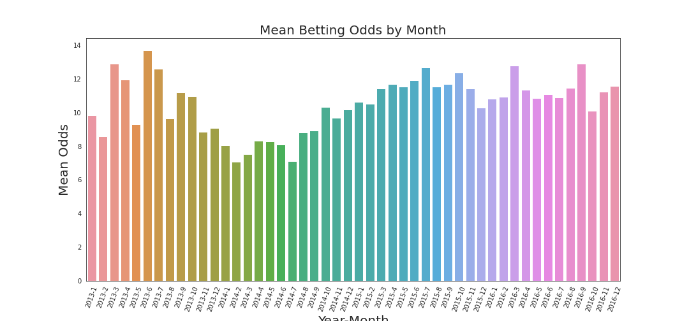

# Horsing Around: Horse Race Betting
  

    - Secretariat at the Belmount in 1974, the year he won the Triple Crown
  

## Can I make money using tipsers in horse race betting?


If you live near a race track, every year during racing season you might see more commotion, friends and family talking of going to see a race as a casual weekend past time. The conversation always eventually reaches betting. Someone might bring up: "Some people actually make a living driving from race to race, betting on the horses."
    
Some others, known as tipsters, make money providing tips on how to bet. In this project, I attempt to explore the question: If you were just a casual horse race bettor, would you win money following a tipster's advice?

## What is a tipster?

A tipster is someone known to be more knowledable about the subject and the outcome of sports events on internet sites or betting places. The information could be about any sport where people bet on the outcome, from football to *football*, horse or greyhound racing, tennis, etc.

### Tipster “Active” vs “Inactive” : 
Aggregation sites online rank tipsters by their profit performance value. At a certain point of negative profit, a tipster becomes “Inactive.” 
**For this data used in this discussion, the performance index used to determine Active/Inactive status is unknown.**

## Data

The data used in this analysis, provided by [@Data Society](https://data.world/data-society) on [Data World](https://data.world/data-society/horse-racing-tipster-bets), contains tips and odds from 31 tipsters, and the result of their bet tip, over a span of 4 years, and whether that tipster was in "Active" status or not.

### First 5 Lines of Raw Data:   




Of note:

  - Odds are read as a ratio to the dollar. For example, for the first row in the picture above, for every dollar bet, you win $23.00, plus the original dollar you put down. Total profit would be $23.00
  - Result is the result of the bet, not the result of the race. 
    - For a 'Win' result, Profit = Odds - 1.00
    - For a 'Lose' result, Profit = -$1.00

## Data Exploration

First, I needed to quantify tipster performance. I took the resultig profit from every single bet and tabulized a summary of the results from each Tipster. Unsurprisingly, while most tipsters won money on the dollar per bet, it was averaged over many tips over time and the profit per bet is not that large.

| Tipster    | Bet Count | Odds   |   | Bet Earnings ($) |   |   | Active Status |
|------------|-----------|--------|---------|------------------|---------|---------|---------------|
|            |           | median | max     | mean             | median  | max     |               |
| Tipster A  | 1331      | 5.5    | 51      | 1.491            | -1.00   | 50.00   | TRUE          |
| Tipster A1 | 2446      | 9      | 201     | 0.444            | -1.00   | 100.00  | TRUE          |
| Tipster B  | 503       | 9      | 130     | 0.556            | -1.00   | 66.00   | TRUE          |
| Tipster C  | 1738      | 12     | 101     | 2.252            | -1.00   | 100.00  | FALSE         |
| Tipster C1 | 501       | 8      | 101     | 0.543            | -1.00   | 33.00   | FALSE         |
| Tipster D1 | 2119      | 17     | 126     | 2.136            | -1.00   | 100.00  | TRUE          |
| Tipster E  | 3700      | 4.33   | 101     | 0.089            | -1.00   | 14.00   | TRUE          |
| Tipster E1 | 609       | 6.5    | 67      | 1.063            | -1.00   | 28.00   | FALSE         |

Interestingly, median values for all tipster bets are -1.00. This means that **over 50% of the time, a tipster's bet LOST**. Whether they were active or not. 
Below is the count of -$1.00 earning for Tipster A


There were also some very large odds that, if won, would greatly shift a tipster's performance index. Most odds were in the 6.0 to 14.0 range, but a few jumped as high as 400.0




## Hypothesis Testing
At first glance, it seems we shouldn't use tipsters as they aggregate profit in the performance and profit over time. But the casual horse race goer will not place bets on every single tip. How can we use statistics to get a more reliable answer?

Let's say, in layman's terms, that

>I want to be 95% confident that I can trust a tipster's tips to win money at a Horse Race.

Since I am using 31 tipsters, that is a max 5% Type I Error rate across 31 tests (Bootstrap Hypothessis Testing), I will use the *'*Bonferroni Correction* method to get confidence level of

> 0.05/31 = 99.92

I ran simulations for each tipster with sample size **n = 10,000** and resampled 1,000 times for each tipster. looked at the sums and means of the 1,000 resamples in order to draw my conclusion.

## Python Implementation
Below is the python function used for bootstrap simulation:

    ```python

    
    from numpy.random import default_rng

    def bootstrap(sample, seed=None, n_bootstrap=10000,stat_function=np.mean):
        
        rng = default_rng(seed)
        bootstrap_samples = rng.choice(sample, size=(n_bootstrap,sample.size))
        bootstrap_agg = stat_function(bootstrap_samples, axis=1)
        return bootstrap_agg

    def bootstrap_ci(boot_sample, ci=95):
        lower = (100 - ci)/2
        higher = 100 - lower

        left_endpoint = np.percentile(boot_sample, lower)
        right_endpoint = np.percentile(boot_sample, higher)
        
        return left_endpoint,right_endpoint
    ```

## Results
Out of 31 tipsters, 12 did not fall in the 95% confidence level
>"I would not trust 12 out of 31, or 38.7% of tipsters to win me any money had I followed their advice"

In other words, there's not enough evidence to support that ~40% of tipsters have skill
Also tot factored in the profit is the cost of employing the tipster.
### Conclusion: Bet at your own risk, and pick tipsters at your own risk!


